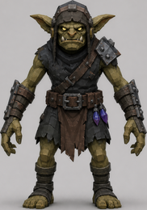
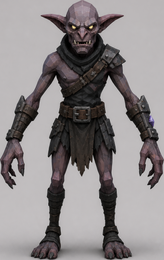
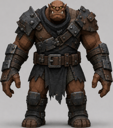
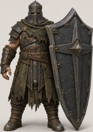
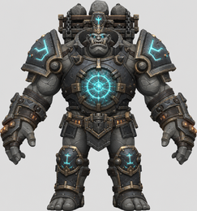

# Crystal Keep — Player Guide

Documentation for **Crystal Keep**, a tower-defense and action-RPG hybrid where
you read an unfamiliar fortress, commit a small number of lanes, and personally
hold the weak points together when the plan meets the enemy.

You are the **Warden**: sword, three position-cast spells, and a regenerating
Ward pool. The keep does the killing. You decide where it kills hardest.

## Start here

- [Getting Started](guides/getting-started.md) — the loop, and three things that will save your first run
- [The Initiation](guides/tutorial.md) — the nine tutorial lessons and why two of them matter most
- [Interface](guides/interface.md) — ribbons, the build wheel, the tactical map, the ledger

## Core systems

- [The Warden](guides/warden.md) — health, Ward, the dash, and the three spells
- [Combat](guides/combat.md) — four damage channels, four control channels, and the hard-zero laws
- [Enemies](guides/enemies.md) — all ten roles, what each one fears and refuses
- [Defenses](guides/defenses.md) — ten defenses across three schools, with costs and mounting rules
- [Waves](guides/waves.md) — the five waves and the counters they announce

## The keep

- [Keeps](guides/keeps.md) — procedural generation, the fairness contract, and landmarks that change routes mid-run
- [Economy](guides/economy.md) — mana, bounties, and the 60% refund

## Progression

- [Progression & Equipment](guides/progression.md) — rarity, item level, and the curve that stops gear from eating the puzzle
- [Nightmare](guides/nightmare.md) — the uncapped ladder, and why both sides grow on the same curve
- [Workshop](guides/workshop.md) — materials, modification, sealing, and salvage
- [Game Modes](guides/game-modes.md) — Keep Assault, Endless Siege, Weekly Keep, and Siege Contracts

## Three rules worth knowing before you play

**The crystal is the only defeat condition.** Your own death is a respawn
timer. Spend yourself on the lane that matters.

**Some matchups deal exactly zero.** A Ballista deals nothing through a
Shieldbearer's front; a Cannon deals nothing to a Fire Demon. No item level or
tower tier changes that. Mixed damage channels are not a preference, they are
the requirement.

**Every keep is generated and every keep is proved fair.** A keep you have
never seen is still winnable before you are shown it — see the
[fairness contract](guides/keeps.md#the-fairness-contract).

---

*This wiki documents what the game implements. Values are verified against the
game source; see `CLAUDE.md` and `.specify/memory/constitution.md` for the
editing rules.*
