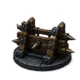
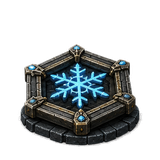
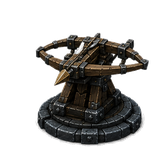
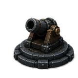
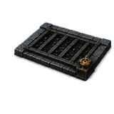
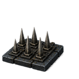
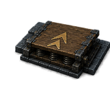
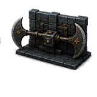
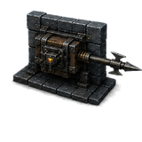
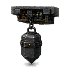

# Defenses

Ten defenses, three schools, one purse. Mana is the only construction resource
in Crystal Keep — there is no separate build currency, no per-type cap, and no
population limit. Everything you place competes with everything else you might
have placed instead.

Defenses are **permanent**. They do not expire, they have no cooldown, and they
do not occupy an ability slot. What you build stays built until it is destroyed
or you sell it.

## The three schools

**Fortifications** mount on the floor and hold ground.
**Floor traps** mount on the floor and trigger on contact or proximity.
**Wall traps** mount on walls, which turns vertical surface into build space.

Every defense has HP. Nothing is indestructible — including the Blockade.

## Fortifications

| Defense | Cost | Channel | Range | Notes |
|---|---:|---|---:|---|
|  Blockade | 60 | — | — | 350 HP. Reroutes enemies; does not attack. |
|  Frost Rune | 80 | — (chill) | 3.5 m | Aura. 40% slow. 150 HP. |
|  Ballista | 100 | Pierce | 3.5–14 m | 90° arc, 15% crit at 2.0×. 220 HP. |
|  Cannon | 125 | Crush | 4.0–12 m | 360° arc, 3.25 m splash, staggers. 220 HP. |

**Minimum range is real.** The Ballista cannot hit anything closer than 3.5 m
and the Cannon nothing closer than 4.0 m. A tower placed on top of a choke has
a hole where the fight is.

**Aim gating.** Targeted defenses hold fire until the head is within **8° of
the target**. Traverse speed therefore matters: the Ballista swings at 120°/s,
the Cannon at 60°/s. A Cannon covering a fast lane spends much of the wave
turning.

## Floor traps

| Defense | Cost | Channel | Trigger | Notes |
|---|---:|---|---|---|
|  Tar | 65 | — (tar) | Contact | 40% slow. Drains on contact. 160 HP. |
|  Spikes | 70 | Pierce | Proximity | 55 power, 1.6 s cycle. 130 HP. |
|  Springboard | 90 | Crush | Proximity | Displaces. 2.2 s cycle. 140 HP. |

## Wall traps

| Defense | Cost | Channel | Trigger | Notes |
|---|---:|---|---|---|
|  Wall Blades | 105 | Slash | Proximity | 42 power, 1.25 s cycle. 165 HP. |
|  Harpoon | 125 | Pierce | Proximity | 85 power, **50% armour pierce**, 12 m. 150 HP. |
|  Wall Maul | 135 | Crush | Proximity | 105 power, staggers, 3.0 s cycle. 180 HP. |

The Wall Maul is the heaviest single hit available and it staggers — which is
why it is one of the few good answers to a Shieldbearer column, and why it does
nothing useful against a runner it cannot catch.

## Traps wear out

Every trap trigger costs the trap durability — 2.0 per trigger for Spikes,
Springboard and Wall Blades, 2.5 for the Harpoon, 3.0 for the Wall Maul. A trap
in a heavily-trafficked lane degrades faster than one covering a quiet
approach. Repair is cheaper than replacement.

## Placement rules

A ghost shows where the defense will land. It refuses for concrete reasons:

- **Surface mismatch.** Floor defenses need a near-level surface; wall traps
  need a near-vertical one. The preview will not lie to you about this.
- **Distance.** You must be within build range of the spot.
- **Overlap.** The footprint must be clear of world, enemies, other defenses
  and the crystal.
- **Sanctuary.** The ground around the crystal is protected — see below.

### The sanctuary is protected ground

On generated keeps, the floor around the crystal is a no-build zone, announced
in the game as *"Sanctuary floor is protected"*. It is not a radius: it is the
set of crystal and sanctuary cells, and the blocked area grows with the
footprint of what you are trying to place. A wide defense is refused further
out than a small one.

The five hand-authored keeps in `--keep` carry no sanctuary data, so the rule
does not apply there. That asymmetry is a property of the legacy keeps, not a
design choice about the crystal.

## Tiers and selling

Defenses upgrade through tiers, paid from the same purse. Selling returns
**60%** of everything invested — including upgrades.

There are two ways to sell: press **X** while aiming at a defense, or open the
build wheel while aiming at one and choose the sell segment.

## Upgrading

Aim at a placed defense and open the build wheel. It becomes a three-option
context menu — **upgrade**, **sell**, or select that defense type for building.

**The wheel is the only way to upgrade.** Aiming at a defense shows a nameplate
prompting `E  UPGRADE` with a cost, but **E** casts Hex of Frailty; there is no
upgrade binding in the control map at all. Pressing it spends 35 Ward and
upgrades nothing. Use the wheel.

## See also

- [Combat](combat.md) — channels, immunities, and what each enemy refuses
- [Economy](economy.md) — mana income, bounties, and refunds
- [Keeps](keeps.md) — the ground you are building on
