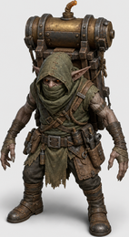
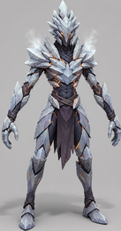
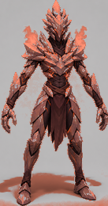
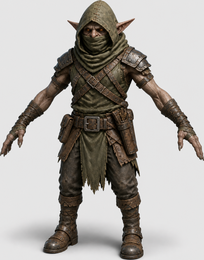
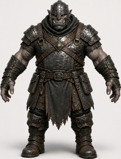

# Enemies

Ten enemy roles. Each has a channel it fears, a channel it shrugs off, and — in
several cases — something it is flatly immune to. Reading this table is
cheaper than losing a wave to it.

Speed is metres per second and does not change with Nightmare. Health and
damage do.

## The roster

| | | | | |
|:--:|:--:|:--:|:--:|:--:|
|  |  |  |  |  |
| **Goblin** | **Runner** | **Orc** | **Shieldbearer** | **Sapper** |
|  |  |  |  |  |
| **Frostbound** | **Fire Demon** | **Crossbowman** | **Bombardier** | **Colossus** |

The Frostbound and the Fire Demon are the same mesh in two colours. That is
not an accident of the art — it is what the game does, and it matters.

### Runner — 35 HP, 5.6 m/s, 6 damage, 12 mana

The fastest thing in the game. Fragile, and takes **1.25× from pierce** but
only 0.90× from slash. Highly susceptible to control: 1.50× displacement, 1.25×
stagger, 1.20× tar. Springboards and Tar handle runners better than raw damage
does.

### Goblin — 60 HP, 3.4 m/s, 8 damage, 14 mana

The baseline. Takes **1.25× from slash** and 1.10× from fire. No resistances
worth planning around. Wave 1 is goblins so you can learn the controls against
something forgiving.

### Crossbowman — 55 HP, 3.2 m/s, 12 damage, 20 mana

Attacks at range and needs line of sight. Takes **1.25× from slash**, resists
pierce (0.90×). Break the sightline or close the distance — a wall between it
and its target is worth more than another tower.

### Frostbound — 65 HP, 4.8 m/s, 8 damage, 20 mana

Fast, and **immune to chill** — a Frost Rune does nothing to it. Takes
**1.50× from fire**. Fireball and Tar are the answers; the Frost Rune is not.

### Fire Demon — 72 HP, 4.5 m/s, 9 damage, 22 mana

The mirror of the Frostbound: **immune to fire**, and takes **1.50× control
from chill**. A Cannon deals it exactly zero. Chill it, then kill it with the
Warden, a Ballista, or a Wall Maul.

> **Frostbound and Fire Demon are the same mesh.** `enemy.gd` builds both from
> one model and separates them by tint — the Fire Demon takes a 58% shift
> toward ember orange plus an emissive glow, against the Frostbound's 18% cool
> grey. Every other enemy in the game gets 18%; the Fire Demon is tinted three
> times harder precisely so you can tell them apart at speed.
>
> They arrive in the same waves and want opposite answers. Colour is the only
> thing telling you which mistake you are about to make.

### Sapper — 80 HP, 3.8 m/s, 10 damage, 25 mana

**Targets your defenses, not the crystal.** Fast and fragile; takes 1.35× from
pierce and 1.20× from slash, resists crush (0.80×). Left alone it will
dismantle the lane you paid for. Intercept it.

### Shieldbearer — 150 HP, 2.8 m/s, 12 damage, 28 mana

**Frontal pierce deals zero.** Not reduced — zero, at any tower level. Takes
1.15× from crush, and resists displacement (0.65×) and stagger (0.60×). Flank
it, or use crush.

### Bombardier — 210 HP, 2.0 m/s, 30 damage, 45 mana

Slow, heavy, and hits hardest of the regular roster. Takes **1.35× from
pierce**, resists slash (0.70×) and is nearly immovable (0.20× displacement).
Can be interrupted — worth **+5 Ward**.

### Orc — 280 HP, 2.2 m/s, 22 damage, 45 mana

The wall. Takes **1.40× from crush** and 1.15× from fire, but only 0.55× from
slash *and* pierce — so both the sword and the Ballista are working at barely
half rate. **Immune to stagger**, and 0.15× displacement.

Orcs are why a keep needs a Cannon.

### Colossus — 1700 HP, 1.45 m/s, 72 damage, 420 mana

Arrives on wave 5. **Immune to displacement**, heavily resistant to chill
(0.45×), tar (0.35×) and stagger (0.30×). Takes 1.35× from crush. Slow enough
to prepare for and too large to solve by position alone.

The 420 bounty is real: killing it funds the rest of the wave.

## Quick answers

| If you see | Bring |
|---|---|
| Runners | Pierce, Springboard, Tar |
| Orcs | Crush — Cannon, Wall Maul |
| Shieldbearers | Crush, or flank the shield |
| Sappers | Pierce, and intercept personally |
| Crossbowmen | Slash, or break line of sight |
| Frostbound | **Fire** — never chill |
| Fire Demons | **Chill**, then any valid damage — never Cannon |
| Bombardiers | Pierce, and interrupt |
| Colossus | Crush, and everything else you own |

## See also

- [Combat](combat.md) — the channel system and the hard-zero laws
- [Waves](waves.md) — when each of these arrives
- [Defenses](defenses.md) — which defense carries which channel
