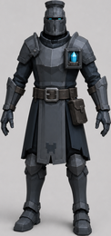

# The Warden

You are not a camera above the battlefield. You are a body in it, with a sword,
three spells, and a limited pool of Ward to spend on them.

The Warden's job is not to out-damage the keep. It is to be wherever the keep
is weakest, and to make the defenses hit harder while you are there.

## Health and Ward

You have two resources and they behave nothing alike.

**Health** falls when you are hit and does not regenerate on its own. If it
reaches zero you go down and respawn on a timer — **5 seconds during combat,
1.5 outside it** — and **the run continues**. The
crystal is the only defeat condition in Crystal Keep. Dying is a setback, not a
loss, and you should be willing to spend yourself on a lane that matters.

**Ward** is a pool of **100** that refills at **6 per second**, constantly and
for free. It pays for your spells and your dash. Because it regenerates and is
capped, Ward at full is Ward being wasted — if you are standing at 100 in the
middle of a wave, you are under-using your kit.

## Movement

| | |
|---|---:|
| Run speed | 6.5 m/s |
| Walk speed | 3.0 m/s |
| Jump | 7.7 |
| Dash speed | 14.0 m/s |
| Dash duration | 0.18 s |
| Dash cost | 15 Ward |
| Dash cooldown | 2.0 s |

The dash has **no invulnerability frames**. It is a repositioning tool, not a
dodge — it moves you out of where the damage will be, and does nothing about
damage already landing.

## The sword

A two-step combo dealing **30** base damage per swing in the **slash** channel,
with a reverse cut on the second step. An attack pressed during recovery is
buffered and chains rather than being dropped, so committing to the first swing
does not cost you the second.

Slash is the wrong channel against orcs (0.55×) and bombardiers (0.70×), and
the right one against goblins (1.25×) and crossbowmen (1.25×).

## The three spells

| | | |
|:--:|:--:|:--:|
|  |  |  |
| **Hex of Frailty** E · 35 Ward | **Mending Ward** F · 30 Ward | **Fireball** C · 45 Ward |

All three are **position-cast**: you aim at a point, there is a windup, and the
effect lands there. Casting roots you for the windup, so cast placement is a
commitment.

### Hex of Frailty — 35 Ward, 0.5 s windup, 14 m

Curses a zone for **18 seconds**. Everything inside takes **30% more damage
from any source** — your sword, your traps, and every tower firing into it. It
also marks a priority enemy, and towers retarget onto the mark.

This is your strongest spell and it deals no damage at all. Hex is how you tell
a lane full of defenses where to concentrate.

### Mending Ward — 30 Ward, 0.4 s windup, 14 m

Heals the nearest defense **120 HP over 8 seconds** and grants it **−25% damage
taken** while active. Saving a defense that was about to die pays **+3 Ward**,
which is most of the cast back.

### Fireball — 45 Ward, 0.8 s windup, 20 m

Impact damage plus a burning effect, in the **fire** channel. Note the two
enemies that care most: a Frostbound takes **1.50×** from fire, and a Fire
Demon takes **zero**. Fireball is a specialist answer, not a general one.

## Counterplay pays Ward

Skilled interventions refund into the pool that funds them:

| Act | Ward |
|---|---:|
| Interrupt a Giant | +8 |
| Interrupt Artillery | +5 |
| **Intercept a Sapper** | **+4** |
| Save a defense with Mend | +3 |
| Flank a Shieldbearer | +2 |
| Colossus last assault | +2 |
| Keeper's Rhythm | +1 |

The loop closes on purpose: support the towers, earn Ward, cast more support.
Ward's cap keeps it from becoming an economy.

## Controls

| Input | Action |
|---|---|
| WASD + mouse | Move and look |
| Space | Jump |
| Shift | Dash |
| Left mouse | Sword / lock placement / confirm facing |
| E / F / C | Hex / Mend / Fireball |
| 1–0, or B / middle mouse | Select a defense, or open the build wheel |
| R / Q | Adjust facing / back out or cancel |
| X | Sell the defense under the crosshair |
| G | Start the next wave |
| I / K / M | Ledger / Workshop / game modes |
| Tab | Tactical map |
| Esc | Pause |

## See also

- [Combat](combat.md) — channels, immunities, and what each enemy refuses
- [Defenses](defenses.md) — what your Hex is amplifying
- [Progression](progression.md) — how equipment changes the Warden
